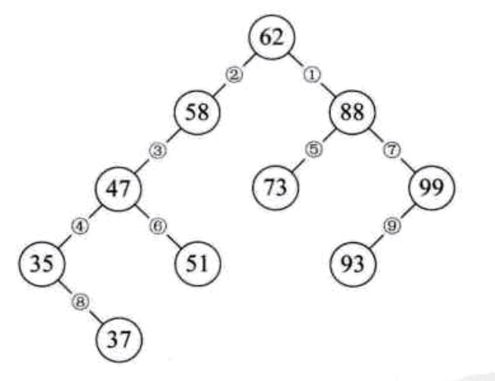

# 二叉排序树

## 一、简介

​	二叉树是为了解决查找和插入问题的效率而诞生的，它的性质是：

​	二叉排序树中的每个结点A，它的左子树所有结点的元素必定比A结点小，它的右子树的所有结点的元素必定比A结点大。这就是二叉排序树最显著的特点了，其它部分都和普通的二叉树一样。



如图，对二叉排序树进行中序遍历之后，会发现结果为：

​											**35 37 47 51 58 62 73 88 93 99**

刚好为从小到大的顺序。

## 二、二叉排序树的性质

1. 若它的左子树不空，则左子树上所有结点的值均小于它的根结点的值
2. 若它的右子树不空，则右子树上所有结点的值均大于它的根结点的值
3. 它的左、右子树也分别为二叉排序树

## 三、二叉排序树的操作
1. 插入（很简单）
2. 删除
   1. 待删除结点没有左子树，则待删除结点的右子树替换掉该结点的位置
   2. 待删除结点没有右子树，则待删除结点的左子树替换掉该结点的位置
   3. 待删除结点左、右子树都有
      1. 将待删除结点左结点开始，一直不停往右孩子走，一直到最后一个结点位置，将该节点删除并移到待删除结点处
      2. 将待删除结点右结点开始，一直不停往左孩子走，一直到最后一个结点位置，将该节点删除并移到待删除结点处 
## 四、代码

```cpp
#include<iostream>
using namespace std;

typedef struct SortTree{
	int data;
	struct SortTree* Left;
	struct SortTree* Right;
}Node;

Node* root;

void initRoot(int key);//初始化根节点
void createChild(int key);//插入孩子节点
void Delete(Node* node, int key);//删除
Node* Find(Node* from_root, Node* node, int key);//定位到待删除节点的前一节点
void visited(Node* node);//中序遍历

int main(void)
{
	initRoot(100);
	createChild(5);
	createChild(123);
	createChild(13);
	createChild(254);
	createChild(99);
	createChild(400);
	cout << "中序遍历结果为: ";
	visited(root);
	Delete(root, 5);
	cout << endl;
	visited(root);
	cout << endl;

	system("pause");
	return 0;
}

void initRoot(int key)
{
	root = new Node;
	root->data = key;
	root->Left = NULL;
	root->Right = NULL;
}

void createChild(int key)
{
	if (root == NULL)
	{
		return;
	}
	else
	{
		Node* temp = root;
		Node* pre = NULL;
		while (temp != NULL)
		{
			if (key < root->data)
			{
				pre = temp;
				temp = temp->Left;
			}
			else
			{
				pre = temp;
				temp = temp->Right;
			}
		}
		if (key < pre->data)
		{
			pre->Left = new Node;
			pre->Left->data = key;
			pre->Left->Left = NULL;
			pre->Left->Right = NULL;
		}
		else
		{
			pre->Right = new Node;
			pre->Right->data = key;
			pre->Right->Left = NULL;
			pre->Right->Right = NULL;
		}

	}
}

void Delete(Node* node, int key)
{
	if (node == NULL)
	{
		return;
	}
	else
	{
		if (key == node->data)
		{
			//删除
			Node* tempNode = Find(root, node, key);
			Node* temp = NULL;
			if (node->Left == NULL)
			{
				temp = node;
				node = node->Right;
				if (tempNode == node)
				{
					delete(tempNode);
					root = node;
					tempNode = NULL;
				}
				if (tempNode->Left == temp)
				{
					Node* free_node = temp;
					tempNode->Left = node;
					delete(free_node);
					free_node = NULL;
				}
				else
				{
					Node* free_node = temp;
					tempNode->Right = node;
					delete(free_node);
					free_node = NULL;
				}
			}
			else if (node->Right == NULL)
			{
				temp = node;
				node = node->Left;
				if (tempNode == node)
				{
					delete(tempNode);
					root = node;
					tempNode = NULL;
				}
				if (tempNode->Left == temp)
				{
					Node* free_node = temp;
					tempNode->Left = node;
					delete(free_node);
					free_node = NULL;
				}
				else
				{
					Node* free_node = temp;
					tempNode->Right = node;
					delete(free_node);
					free_node = NULL;
				}
			}
			else
			{
				Node* pre = node;
				Node* temp = node;
				pre = pre->Left;
				while (pre->Right != NULL)
				{
					temp = pre;
					pre = pre->Right;
				}
				node->data = pre->data;
				if (temp != node)
				{
					Node* free_node = pre;
					temp->Right = pre->Left;
					delete(free_node);
					free_node = NULL;
				}
				else
				{
					Node* free_node = pre;
					temp->Left = pre->Left;
					delete(pre);
					free_node = NULL;
				}
			}
		}
		else if (key < node->data)
		{
			Delete(node->Left, key);
		}
		else
		{
			Delete(node->Right, key);
		}
	}
}

Node* Find(Node* from_root, Node* node, int key)
{
	if (node == from_root)
	{
		return node;
	}
	if (from_root->Left != NULL && from_root->Left->data == key)
	{
		return from_root;
	}
	else if (from_root->Right != NULL && from_root->Right->data == key)
	{
		return from_root;
	}
	else
	{
		if (key < from_root->data)
		{
			Find(from_root->Left, node, key);
		}
		else if (key > from_root->data)
		{
			Find(from_root->Right, node, key);
		}
	}
}

void visited(Node* node)
{
	if (node == NULL)
	{
		return;
	}

	visited(node->Left);
	cout << node->data << " ";
	visited(node->Right);
}
```

