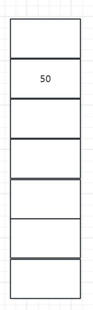
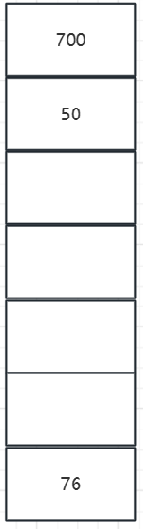
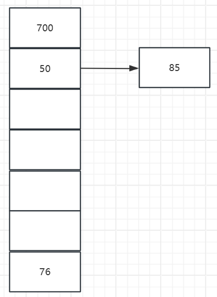
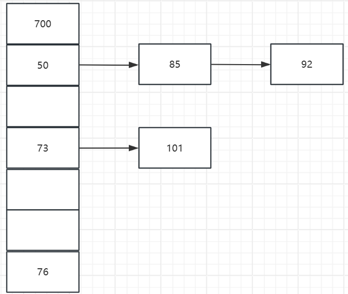
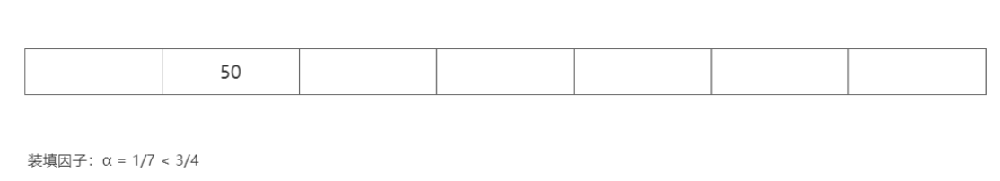
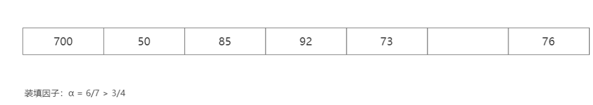
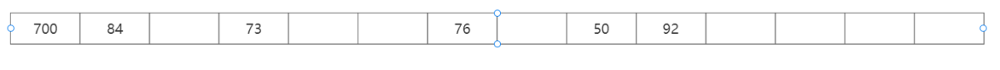

# 哈希表（散列表）

## 一、简介

哈希表本质上就是用于存储数据的顺序表，只不过与一般顺序表不同的是，哈希表的下标是经过哈希函数映射后的输出值

基本概念：

1. 哈希函数
   1. 特点：用于将一个大数或者一个字符串转换为较小整数索引的函数
   2. 好的哈希函数应该满足：1. 效率高 2. 同一性 3. 雪崩效应 4. 不可反向推导

2. 哈希冲突：当一个新的数值被插入到哈希表当中，经过哈希函数映射恰好输出到了一个已经被占用的槽位

3. 装填因子：
   $$
   a = \frac{n}{m}
   $$
   其中n为关键字的个数，m为哈希表的表长
   
4. 同义词：对于两个关键字，经过相同的哈希函数映射之后输出的值相同，则这两个关键字称为同义词

5. 原始聚集：相对于线性探测法而言的，不太好描述，自己百度一下吧

6. 二次堆积：当表中i,i+1,i+2位置上以填有记录时,下一个哈希地址为i,i+1和i+2的记录都将填入i+3的位置,这种在处理冲突过程中发生的**两个第一个哈希地址不同**的记录**争夺同一个后继哈希地址**的现象称做"二次聚集"

## 二、常用的哈希函数映射方式

### 1、除留余数法

哈希函数为：
$$
F(key) = key \bmod p
$$
其中p <= m(m为表长)，F(x)即为求出来的哈希下标

### 2、直接定制法

哈希函数为：
$$
F(x) = A \times key + B
$$
其中A、B为常数

### 3、平方取中法

将key平方，并将平方后中间的某几位作为最终的存储地址下标

例：key = 1234， key X key = 1522756，则227作为映射的值

## 三、解决哈希冲突的常见算法

### 1、链地址法

思想：将所有冲突的元素用一个单链表串起来

举个例子，我们用除留余数法，除数为7，一组元素为：[50, 700, 76, 85, 92, 73, 101]进行哈希表的构成。

首先插入元素50，50 % 7 = 1



之后插入700和76



之后插入85，发现85 % 7 = 1，和50的位置冲突，于是用链表连接起来



往复插入，最后形成完整的哈希表



代码：

```cpp
// 暂时没有写过，以后有时间再补充，难度不算大，前面我们实现过
// 顺序表和链表，连地址法的哈希表实际上就是数组+链表的结构
```

### 2、开放地址法

#### 1）线性探测法

$$
F(key) = (F(key) + i) \bmod p
$$

其中i为0, 1, 2, 3, ... , n的整数

举个例子：

- 如果 F(x) % p 已经有数据，则尝试 (F(x) + 1) % p ;
- 如果 (F(x) + 1) % p 也有数据了，则尝试 (F(x) + 2) % p ;
- 如果 (F(x) + 2) % p 也有数据了，则尝试 (F(x) + 3) % p ;  

代码：

```cpp
#include<iostream>
using namespace std;
#define MAXSIZE 10

typedef struct {
	int* element;
	int count;
}HashTable;

int m = 0;//用于记录长度

void initHashTable(HashTable* H)
{
	m = MAXSIZE;
	H->element = new int[MAXSIZE];
	H->count++;
	for (int i = 0; i < m; i ++)
	{
		H->element[i] = NULL;
	}
}

int Hash(int key)
{
	return key % m;
}

void Insert(HashTable* H, int key)
{
	int addr = Hash(key);
	while (H->element[addr] != NULL)
	{
		addr = (addr + 1) % m; // 这里是核心
	}
	H->element[addr] = key;
	H->count++;
	float t = H->count ;
	if (t / m > 0.75)
	{
		//再哈希
	}
}

int SearchHash(HashTable* H, int key)
{
	int addr = Hash(key);
	while (H->element[addr] != NULL)
	{
		addr = (addr + 1) % m;
		if (H->element[addr] == NULL || addr == Hash(key))
		{
			return 0;
		}
	}
	return 1;
}
```


#### 2）平方探测法

思路和线性探测法类似
$$
F(key) = (F(key) + i \times i) \bmod p
$$
其中i为0, 1, 2, 3, ... , n的整数

举个例子：

- 如果 F(x) % p 已经有数据，则尝试 (F(x) + 1 * 1) % p ;
- 如果 (F(x) + 1 * 1) % p 也有数据了，则尝试 (F(x) + 2 * 2) % p ;
- 如果 (F(x) + 2 * 2) % p 也有数据了，则尝试 (F(x) + 3 * 3) % p ;  

代码：

```cpp
#include<iostream>
using namespace std;
#define MAXSIZE 10

typedef struct {
	int* element;
	int count;
}HashTable;

int m = 0;//用于记录长度

void initHashTable(HashTable* H)
{
	m = MAXSIZE;
	H->element = new int[MAXSIZE];
	H->count++;
	for (int i = 0; i < m; i ++)
	{
		H->element[i] = NULL;
	}
}

int Hash(int key)
{
	return key % m;
}

void Insert(HashTable* H, int key)
{
    int i = 0;
	int addr = Hash(key);
	while (H->element[addr] != NULL)
	{
		addr = (addr + i * i) % m; // 这里是核心
        i ++;
	}
	H->element[addr] = key;
	H->count++;
	float t = H->count ;
	if (t / m > 0.75)
	{
		//再哈希
	}
}

int SearchHash(HashTable* H, int key)
{
	int addr = Hash(key);
	while (H->element[addr] != NULL)
	{
		addr = (addr + 1) % m;
		if (H->element[addr] == NULL || addr == Hash(key))
		{
			return 0;
		}
	}
	return 1;
}
```

#### 3）双重哈希

现在有两个哈希函数,F1(x)和F2(x)
$$
F(x) = (F1(x) + i \times F2(x)) \bmod p
$$
其中i为0, 1, 2, 3, ... , n的整数

- 如果 F1(x) % p 已经有数据，则尝试 (F1(x) + 1 * F2(x)) % p;
- 如果 (F1(x) + 1 * F2(x)) % p 也有数据了，则尝试 (F1(x) + 2 * F2(x)) % p;
- 如果 (F1(x) + 2 * F2(x)) % p 也有数据了，则尝试 (F1(x) + 3 * F2(x)) % p;  

代码：

```cpp
// 这里代码都和上面差不多，唯一的区别就是哈希映射的方式不太一样
```

## 四、更多的优化思路

### 1、再哈希

我们一般将固有的装填因子和一个默认值比较（一般为0.75），我们每次在哈希表中插入新的元素的时候我们都计算一次装填因子，并将其数值和0.75相比较，如果该装填因子高出0.75，我们就可以进行再哈希（对原哈希表进行扩容），遍历原始哈希表的每个元素并将其插入到新的哈希表当中（哈希的规则会发生变化）。

这是一个哈希表



然后我们不断插入元素直到满足装填因子大于0.75



此时进行再哈希，对整个哈希表进行扩容，然后再将数值全部插入一遍

