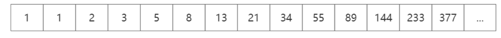
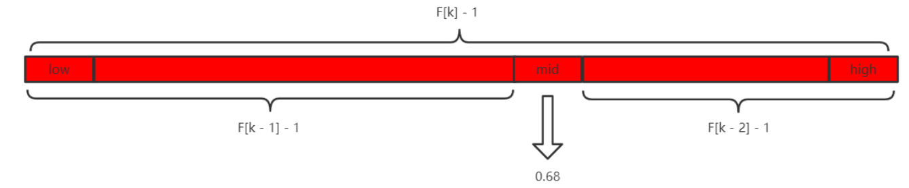
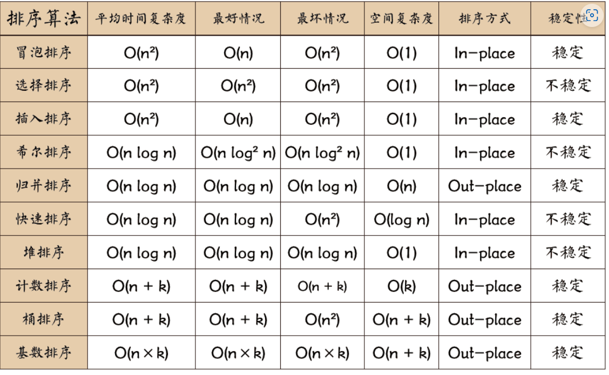
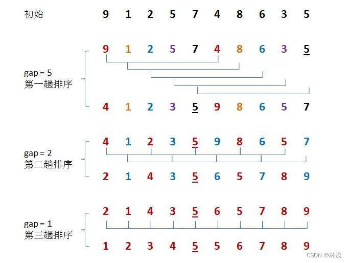
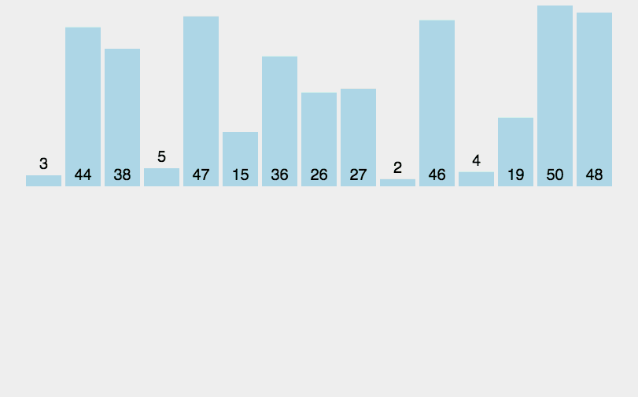

# 查找和排序

## 一、查找

算法分类：

1. 静态查找和动态查找
   1. 静态查找：只作查找操作
   2. 动态查找：在查找的过程中同时还会插入或者删除查找表中的元素
2. 无序查找和有序查找
   1. 无序查找：被查找的数列有序或者无序均可
   2. 有序查找：被查找到数列必须有序

基本概念：

1. 平均查找长度（**Average Search Lengt** ASL）：在查找运算中时间主要花费在关键字的比较上，把平均需要和给定值进行比较的关键字次数称为
   平均查找长度。
   $$
   ASL = \sum_{i=1}^{n}P_{i}C_{i}
   $$
   n是查找表中元素的个数，P~i~是查找到第i个元素的概率，C~i~是查找到第i个元素需要比较的次数。

2. 查找表：同一类型的数据元素（或记录）构成的集合

3. 关键字：数据元素中某个数据项的值

### 1、顺序查找

基本思想：依次扫描关键字与给定的值进行比较，若相等则查找成功

前提：下标为0的位置不被使用，查找的数组下标从1开始

基本思路：

```cpp
#define T int

int Sequential_Search(T *a, int n, T key) {
    for (int i = 1; i <= n; i ++) {
        if (a[i] == key) {
            return i;
        }
    }
    return 0;
}
```

但是简单的顺序查找我们每次都会与n作比较检查是否越界，于是我们可以设置一个哨兵，这样就不需要每次都和n作比较了。

```cpp
#define T int

int Sequential_Search(T *a, int n, T key) {
    a[0] = key; // 设置哨兵
    int i = n;
    while (a[i] != key) {
        i --;
    }
    return i;
}
```

### 2、二分查找（折半查找）

```cpp
#define T int

int Binary_Search(T *a, int n, T key) {
    int low, high, mid;
    low = 1;
    high = n;
    while (low <= high) {
        mid = (low + high) / 2;
        if (key < a[mid]) {
            high = mid - 1;
        } else if (key > a[mid]) {
            low = mid + 1;
        } else {
            return mid;
        }
    }
    return 0;
}
```

### 3、插值查找

插值查找本质上是对二分查找的改进：

二分查找中：
$$
mid = (high - low) / 2
$$

$$
= low + \frac{1}{2} \times (high - low)
$$

插值查找就是对其中的1/2进行了改进替换为了
$$
mid = low + \frac{key - a[low]}{a[high] - a[low]} \times (high - low)
$$


```cpp
#define T int

int InsertionSearch(T *a, T value, int low, int high)
{
    int mid = low + (value - a[low] ) / (a[high] - a[low]) * (high - low);
    if(a[mid] == value)
        return mid;
    if(a[mid] > value)
        return InsertionSearch(a, value, low, mid-1);
    if(a[mid] < value)
        return InsertionSearch(a, value, mid+1, high);
}
```

### 4、斐波那契查找

本质上也是对二分查找的一种优化。

下面为一个斐波那契序列：
$$
F[k] = F[k - 1] + F[k - 2]
$$



除了第一个元素和第二个元素的比值为1以外，后面的元素前一个和后一个的比值随着斐波那契数越大逐渐接近0.618



和二分查找相比，mid的选择是这样的，如图

```cpp
#include <memory>
#include  <iostream>
using namespace std;

#define T int
const int max_size=20;//斐波那契数组的长度
 
/*构造一个斐波那契数组*/ 
void Fibonacci(int * F)
{
    F[0]=0;
    F[1]=1;
    for(int i=2;i<max_size;++i)
        F[i]=F[i-1]+F[i-2];
}
 
/*定义斐波那契查找法*/  
int FibonacciSearch( *a, int n, T key)  //a为要查找的数组,n为要查找的数组长度,key为要查找的关键字
{
  int low=0;
  int high=n-1;
  
  int F[max_size];
  Fibonacci(F);//构造一个斐波那契数组F 
 
  int k=0;
  while(n>F[k]-1)//计算n位于斐波那契数列的位置
      ++k;
 
  int  * temp;//将数组a扩展到F[k]-1的长度
  temp=new int [F[k]-1];
  memcpy(temp,a,n*sizeof(int));
 
  for(int i=n;i<F[k]-1;++i)
     temp[i]=a[n-1];
  
  while(low<=high)
  {
    int mid=low+F[k-1]-1;
    if(key<temp[mid])
    {
      high=mid-1;
      k-=1;
    }
    else if(key>temp[mid])
    {
     low=mid+1;
     k-=2;
    }
    else
    {
       if(mid<n)
           return mid; //若相等则说明mid即为查找到的位置
       else
           return n-1; //若mid>=n则说明是扩展的数值,返回n-1
    }
  }  
  delete [] temp;
  return -1;
}
 
int main()
{
    int a[] = {0,16,24,35,47,59,62,73,88,99};
    int key=100;
    int index=FibonacciSearch(a,sizeof(a)/sizeof(int),key);
    cout<<key<<" is located at:"<<index;
    return 0;
}
```

## 二、排序

以下排序不全，主要针对考试整理的

**声明：排序部分全为搬运和整理，推荐的链接：**

1. [八大排序算法详解（通俗易懂）-CSDN博客](https://blog.csdn.net/weixin_61661271/article/details/126144187)

2. [轻松搞定十大经典排序算法（冒泡排序、选择排序、插入排序、希尔排序、快速排序、归并排序、堆排序、计数排序、桶排序和基数排序）_哔哩哔哩_bilibili](https://www.bilibili.com/video/BV1Ur4y1w7tv/?spm_id_from=333.337.search-card.all.click)

3. [动画阐释各种排序算法（之前误删了大家也不用再点赞投币了）_哔哩哔哩_bilibili](https://www.bilibili.com/video/BV1CY4y1t7TZ/?spm_id_from=333.337.search-card.all.click&vd_source=4e0d0cb650fa7f0cb4ae8b51d183d2e2)



### 1、冒泡排序


代码：

```cpp
void BubbleSort(int* arr, int size)//冒泡排序
{
	for (int i = 1; i < size; i++)
	{
		int flag = 0;
		for (int j = 0; j < size - i; j++)
		{
			if (arr[j] > arr[j + 1])
			{
				Swap(&arr[j], &arr[j + 1]);
				flag++;
			}
		}
		if (flag == 0)
		{
			break;
		}
	}
}
```

### 2、插入排序


代码：

```cpp
void InsertSort(int* arr, int size)//直接插入排序
{
	for (int i = 0; i < size - 1; i++)
	{
		//单趟插入排序
		//基本思想：[0,end]区间值为有序
		int end = i;
		int tmp = arr[end + 1];
		while (end >= 0)
		{
			if (tmp < arr[end])
			{
				arr[end + 1] = arr[end];
				end--;
			}
			else
			{
				break;//在这里break出去再去赋值tmp是为了防止最后一次end = -1进不来赋值
			}
		}
		arr[end + 1] = tmp;
	}
}
```

### 3、选择排序


代码：

```cpp
void SelectSort(int* arr, int size)//优化选择排序
{
	int begin = 0;
	int end = size - 1;
	while (begin < end)
	{
		int mini = begin, maxi = begin;
		for (int i = begin + 1; i <= end; i++)
		{
			if (arr[i] < arr[mini])
			{
				mini = i;
			}
			if (arr[i] > arr[maxi])
			{
				maxi = i;
			}
		}
		Swap(&arr[mini], &arr[begin]);
		//如果maxi = begin，上一步交换了begin和mini的值，会影响maxi指向的值
		if (maxi == begin)
		{
			maxi = mini;
		}
		Swap(&arr[maxi], &arr[end]);
		begin++;
		end--;
	}
}
```

### 4、希尔排序



- 当gap越大，预排序越快，但是越不接近有序
- 当gap越小，数据处理越慢，越接近有序
- 当gap为1即插入排序

代码：

```cpp
void ShellSort(int* arr, int size)//希尔排序
{
	int gap = size;
	//多次预排+最后一次直接插入排序
	while (gap > 1)
	{
		gap = gap / 3 + 1;//控制最后一次进来gap为1进行直接插入排序
		for (int i = 0; i < size - gap; i++)
		{
			int end = i;
			int tmp = arr[end + gap];
			while (end >= 0)
			{
				if (tmp < arr[end])
				{
					arr[end + gap] = arr[end];
					end -= gap;
				}
				else
				{
					break;
				}
			}
			arr[end + gap] = tmp;
		}
	}
}
```


### 5、快速排序


代码：

```cpp
void quick_sort(int q[], int l, int r)
{
    if (l >= r) return;

    int i = l - 1, j = r + 1, x = q[l + r >> 1];
    while (i < j)
    {
        do i ++ ; while (q[i] < x);
        do j -- ; while (q[j] > x);
        if (i < j) swap(q[i], q[j]);
    }
    quick_sort(q, l, j), quick_sort(q, j + 1, r);
}
```

### 6、归并排序



代码：

```cpp
void merge_sort(int q[], int l, int r)
{
    if (l >= r) return;

    int mid = l + r >> 1;
    merge_sort(q, l, mid);
    merge_sort(q, mid + 1, r);

    int k = 0, i = l, j = mid + 1;
    while (i <= mid && j <= r)
        if (q[i] <= q[j]) tmp[k ++ ] = q[i ++ ];
        else tmp[k ++ ] = q[j ++ ];

    while (i <= mid) tmp[k ++ ] = q[i ++ ];
    while (j <= r) tmp[k ++ ] = q[j ++ ];

    for (i = l, j = 0; i <= r; i ++, j ++ ) q[i] = tmp[j];
}
```


